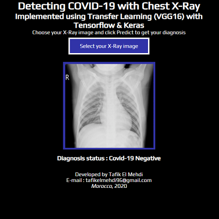

# Flask Web-App Covid-19 Detection 
[]() 
[]()
[]()
[]()

This projects includes both back-end (Keras, Flask with dependencies) and front-end/deployement (HTML, CSS, JS) parts. The project perform Covid-19 classification from chest X-Rays images using Transfer Learning (VGG16) with automated image pre-processing and internal procedures. The final accuracy of the model is approximately 93%.

For deploying we will use Flask instead of Django because of it simplicity and compatibility with Amazon Web Services (AWS) and Google Cloud Storage (GCS). That works fine. App Engine in GCS is a perfect tool for deploying a Keras model as web application. 

Some additional work with HTML, CSS and Javascript and the model front-end looks bright, simply and user friendly, even compatible with mobile phones.

## Set up app the Web-App locally
  - Clone The Repository or Download Zip & Extract it.
  - Install Requirements ```pip install -r requirements.txt```
  - To run the app on localhost run ```python main.py```
  - App is running at ```http://127.0.0.1:5000/```

**Dataset**

<pre>
Dataset Name : Chest X-Ray Images (Pneumonia)
Dataset Link : https://www.kaggle.com/paultimothymooney/chest-xray-pneumonia
</pre>

## Web-App
**Home Page :**
<p align="center">
	</img>
</p>

**Prediction :**
<table><tr>
<td> 
  <p align="center" style="padding: 10px">
    
  </p> 
</td>
<td> 
  <p align="center">
    
  </p> 
</td>
</tr></table>